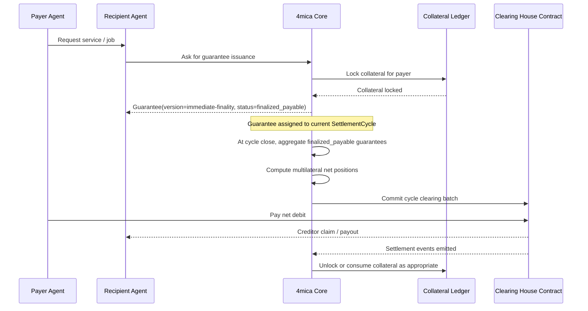
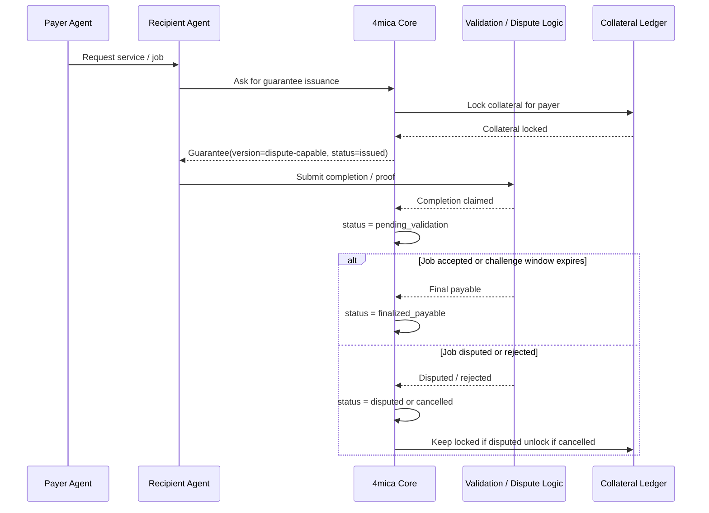
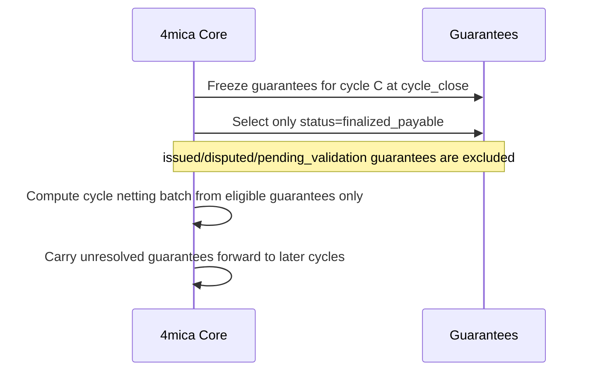
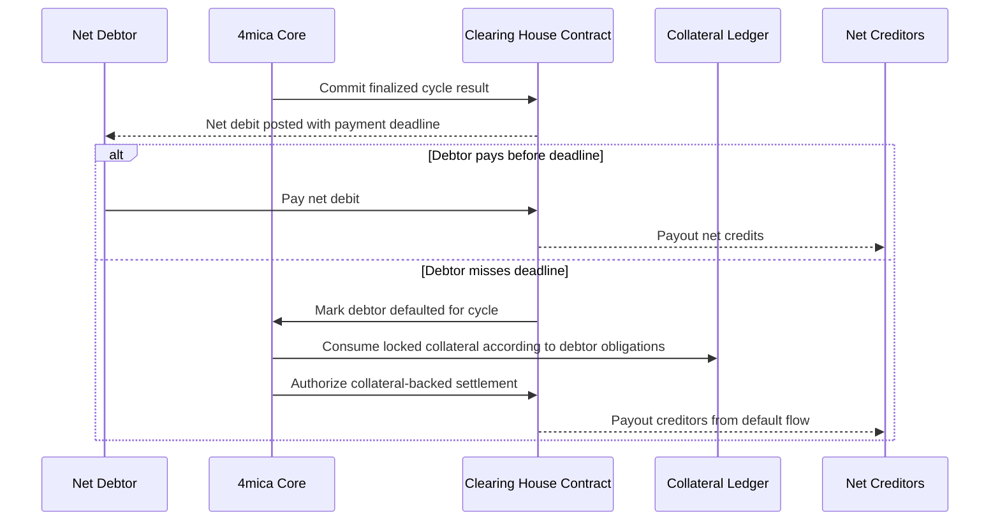

# Netting Cycles, Guarantee Finality, and Clearing

## Decision

For multilateral netting with multiple guarantee versions, including versions that support dispute resolution, the protocol does **not** need tabs as a core settlement primitive.

The core primitives should be:

- `Guarantee`: one per microtransaction
- `Collateral`: locked against issued guarantees
- `SettlementCycle`: fixed time window used for netting and payment deadlines
- `ClearingHouse`: smart contract that enforces final settlement and default handling

`Tab` can still exist as an **optional reporting/product view**:

- "what A spent with B this week"
- "what guarantees A issued to B in cycle C"
- "what bilateral gross exposure existed before netting"

But settlement should be driven by `SettlementCycle`, not by `Tab`.

## Why Tabs Are Optional

Tabs were useful when the settlement model was:

- bilateral
- period-bounded
- one close event
- one payer-to-payee settlement

Multilateral netting changes that.

At cycle close, the payable object is no longer "A owes B on tab X". It becomes:

- "A is net debtor for cycle C"
- "B is net creditor for cycle C"

That means:

- guarantees remain bilateral and directional
- settlement becomes participant-level and cycle-level
- tabs stop being the thing that users pay

So the cleanest protocol model is:

- guarantees feed cycles
- cycles feed clearing
- tabs, if kept, are derived views

## Core Objects

### 1. Guarantee

One guarantee per microtransaction.

Fields:

- `guarantee_id`
- `guarantee_version`
- `cycle_id`
- `payer`
- `payee`
- `asset`
- `amount`
- `issued_at`
- `status`

The important point is that **guarantee version controls finality semantics**.

#### Existing guarantee claim shape in the repo

The canonical guarantee payload already exists as `PaymentGuaranteeClaims` in
[`crates/rpc/src/guarantee/types.rs`](/Users/maironmahzoun/4mica-core/crates/rpc/src/guarantee/types.rs:24):

```rust
pub struct PaymentGuaranteeClaims {
    pub domain: [u8; 32],
    pub user_address: String,
    pub recipient_address: String,
    pub tab_id: U256,
    pub req_id: U256,
    pub amount: U256,
    pub total_amount: U256,
    pub asset_address: String,
    pub timestamp: u64,
    pub version: u64,
    pub validation_policy: Option<PaymentGuaranteeValidationPolicyV2>,
}
```

That is the signed economic claim.

For cycle-based netting, the system should wrap it in an internal persistence object that adds
finality and cycle membership:

```rust
pub enum GuaranteeSettlementStatus {
    Issued,
    PendingValidation,
    FinalizedPayable,
    Disputed,
    Cancelled,
    Netted,
    Settled,
    DefaultRemunerated,
}

pub struct GuaranteeRecord {
    pub guarantee_id: String,
    pub cycle_id: String,
    pub claims: PaymentGuaranteeClaims,
    pub settlement_status: GuaranteeSettlementStatus,
    pub dispute_deadline: Option<i64>,
    pub finalized_at: Option<i64>,
    pub netted_at: Option<i64>,
    pub settled_at: Option<i64>,
    pub created_at: i64,
    pub updated_at: i64,
}
```

Notes:

- `PaymentGuaranteeClaims` stays the signed, versioned promise
- `GuaranteeRecord` is the internal lifecycle row used by `core/`
- `cycle_id` belongs here, not in the signed claim, if the system wants cycle assignment to remain
  an internal accounting choice
- `tab_id` can remain in the claim for compatibility, but should be understood as legacy/bilateral
  grouping metadata rather than the actual settlement object

### 2. Collateral

Collateral is locked when guarantees are issued.

Collateral state is gross while guarantees are unresolved:

- issued -> keep locked
- disputed -> keep locked
- finalized payable -> still locked until cycle clearing completes
- cancelled/rejected -> unlock
- defaulted -> collateral is consumed

### 3. SettlementCycle

A settlement cycle is the fixed bucket for:

- guarantee membership
- dispute cut-off
- multilateral netting
- payment deadline
- default resolution

Example:

- cycle length: `7 days`
- cycle close: Sunday `00:00 UTC`
- resolution cutoff: Sunday `06:00 UTC`
- clearing posted: Sunday `07:00 UTC`
- payment deadline: Sunday `12:00 UTC`

#### Proposed settlement cycle structure

```rust
pub enum SettlementCycleStatus {
    Open,
    Frozen,
    NettingComputed,
    ClearingCommitted,
    PaymentWindowOpen,
    Finalized,
    Defaulted,
    Cancelled,
}

pub struct SettlementCycle {
    pub cycle_id: String,
    pub asset_address: String,
    pub accepted_guarantee_versions: Vec<u64>,
    pub period_start: i64,
    pub period_end: i64,
    pub resolution_cutoff: i64,
    pub clearing_commit_deadline: i64,
    pub payment_deadline: i64,
    pub status: SettlementCycleStatus,
    pub total_guarantee_count: u64,
    pub eligible_guarantee_count: u64,
    pub gross_payable_amount: U256,
    pub gross_receivable_amount: U256,
    pub net_settlement_amount: U256,
    pub clearing_batch_hash: Option<[u8; 32]>,
    pub created_at: i64,
    pub updated_at: i64,
}
```

`SettlementCycle` is the real payable bucket.

It owns:

- the time window
- the netting cutoffs
- the participant net positions
- the clearing commitment submitted on-chain

#### Bilateral exposure view inside a cycle

`core/` still needs bilateral gross accounting even if settlement becomes multilateral:

```rust
pub struct CycleExposureEdge {
    pub cycle_id: String,
    pub payer: String,
    pub payee: String,
    pub asset_address: String,
    pub gross_amount: U256,
    pub finalized_payable_amount: U256,
    pub disputed_amount: U256,
    pub cancelled_amount: U256,
    pub guarantee_count: u64,
}
```

This is the replacement for "tab as settlement object".

If product still wants a "tab", it can be derived from `CycleExposureEdge`.

#### Participant position produced by netting

```rust
pub enum ParticipantCycleRole {
    NetDebtor,
    NetCreditor,
    Flat,
}

pub enum ParticipantCycleStatus {
    Unpaid,
    Paid,
    Received,
    Defaulted,
    Finalized,
}

pub struct CycleParticipantPosition {
    pub cycle_id: String,
    pub participant: String,
    pub asset_address: String,
    pub gross_outgoing: U256,
    pub gross_incoming: U256,
    pub net_debit: U256,
    pub net_credit: U256,
    pub role: ParticipantCycleRole,
    pub status: ParticipantCycleStatus,
    pub settlement_tx_hash: Option<String>,
    pub created_at: i64,
    pub updated_at: i64,
}
```

This is the object the participant actually pays or receives.

### 4. ClearingHouse

The clearing house should be on-chain.

Its job is to:

- register the cycle result
- accept debtor payments
- pay creditors
- handle debtor default via collateral-backed settlement
- emit final settlement events

The clearing house should **not** compute the netting algorithm itself.

That computation belongs in `core/`.

#### Off-chain batch committed to the clearing house

`core/` should compute and sign a clearing batch like:

```rust
pub struct ClearingBatch {
    pub cycle_id: String,
    pub asset_address: String,
    pub batch_hash: [u8; 32],
    pub merkle_root: [u8; 32],
    pub total_net_debit: U256,
    pub total_net_credit: U256,
    pub debtor_count: u64,
    pub creditor_count: u64,
    pub committed_at: i64,
}

pub struct ClearingLeaf {
    pub cycle_id: String,
    pub participant: String,
    pub asset_address: String,
    pub net_debit: U256,
    pub net_credit: U256,
}
```

The exact commitment format can be:

- full arrays on-chain for small cycles
- Merkle root plus per-user proofs for larger cycles

For scale, Merkle commitment is the safer default.

#### Proposed clearing house contract state

```rust
pub enum OnchainCycleStatus {
    Committed,
    PaymentWindowOpen,
    Finalized,
    Defaulted,
}

pub struct OnchainCycle {
    pub cycle_id: bytes32,
    pub asset: address,
    pub merkle_root: bytes32,
    pub total_net_debit: uint256,
    pub total_net_credit: uint256,
    pub payment_deadline: uint64,
    pub status: OnchainCycleStatus,
}

pub struct OnchainParticipantState {
    pub net_debit: uint256,
    pub net_credit: uint256,
    pub paid: bool,
    pub claimed: bool,
    pub defaulted: bool,
}
```

#### Proposed clearing house interface

The contract should look like a settlement enforcer, not a graph engine:

```solidity
function commitCycle(
    bytes32 cycleId,
    address asset,
    bytes32 merkleRoot,
    uint256 totalNetDebit,
    uint256 totalNetCredit,
    uint64 paymentDeadline
) external;

function payNetDebit(
    bytes32 cycleId,
    uint256 amount,
    bytes32[] calldata proof
) external;

function claimNetCredit(
    bytes32 cycleId,
    uint256 amount,
    bytes32[] calldata proof
) external;

function markDefaulted(bytes32 cycleId, address debtor) external;

function finalizeCycle(bytes32 cycleId) external;
```

If the contract should actively consume collateral, add:

```solidity
function settleDefaultFromCollateral(
    bytes32 cycleId,
    address debtor,
    uint256 amount
) external;
```

That call can be restricted to the core operator / manager / settlement role.

#### What the clearing house should *not* know

The clearing house should not directly know:

- individual guarantees
- guarantee versions
- dispute semantics
- bilateral tab logic

It should only know:

- the committed cycle result
- who must pay
- who may claim
- when payment default occurs
- how much collateral-backed settlement to accept

## Guarantee Finality Model

Not every issued guarantee is immediately eligible for netting.

Each guarantee moves through a finality state machine:

1. `issued`
2. `pending_validation`
3. one of:
   - `finalized_payable`
   - `disputed`
   - `cancelled`
4. if included in cycle clearing:
   - `netted`
   - `settled`
   - `default_remunerated`

Only `finalized_payable` guarantees are eligible for multilateral netting.

This is required for dispute-capable guarantee versions.

## High-Level Flow

### Phase 1. Issuance

- user has deposited collateral
- every microtransaction creates a guarantee
- `core/` stores the guarantee and locks collateral
- guarantee is assigned to the current settlement cycle

### Phase 2. Resolution

- immediate-finality versions may become `finalized_payable` immediately
- dispute-capable versions wait for:
  - proof of completion
  - challenge window expiry
  - validation/arbitration outcome

### Phase 3. Cycle Close

At cycle close:

- freeze cycle membership
- unresolved guarantees do **not** enter this cycle's netting batch
- unresolved guarantees roll forward until they become final or are cancelled

### Phase 4. Netting in `core/`

For guarantees that are `finalized_payable`:

- aggregate bilateral gross exposures
- compute one net position per participant
- produce the cycle clearing batch

### Phase 5. On-Chain Clearing

`core/` submits the batch to the clearing house contract.

Then:

- net debtors pay the clearing house
- clearing house pays net creditors
- if a debtor does not pay before the deadline, collateral/default flow is triggered

### Phase 6. Allocation and Accounting

After the clearing house finalizes:

- `core/` consumes events
- marks guarantees as settled/default-remunerated
- updates collateral accounting
- optionally exposes bilateral/tab-style reports

## Sequence Diagrams

### 1. Happy Path: Immediate-Finality Guarantee -> Cycle Netting -> Clearing



### 2. Dispute-Capable Guarantee Version



### 3. Cycle Close with Unresolved Guarantees



### 4. Debtor Default in Clearing



## What Happens to "Tabs" If We Keep Them

If product or reporting still wants tabs, treat them as a **view**, not a settlement primitive.

A tab can mean:

- all guarantees from payer `A` to payee `B`
- for asset `USDC`
- during settlement cycle `C`

In that model:

- tabs are bilateral gross reports
- guarantees are the atomic records
- cycle positions are the actual payable objects

So a tab can still answer:

- how much A consumed from B
- which guarantees were disputed
- which version each guarantee used

But the thing that gets paid is still the participant's net cycle position, not the tab itself.

## Recommended Protocol Shape

### Keep

- guarantee-per-microtransaction
- collateral-backed issuance
- guarantee versions with different finality semantics
- multilateral netting in `core/`
- on-chain clearing house

### Remove as core primitive

- tabs as the actual settlement object

### Keep only as optional product layer

- bilateral tab views
- per-counterparty weekly statements
- recipient/payer reports

## Answer to "Do We Need Tabs?"

Protocol answer:

- **No**, not as a core primitive, if settlement is multilateral and cycle-based.

Product/reporting answer:

- **Maybe**, if you want bilateral statements, limits, dashboards, or UX language around "your weekly tab with provider X".

## Summary

The clean architecture is:

- `Guarantee` is the atomic promise
- `GuaranteeVersion` defines the finality/dispute rule
- only `finalized_payable` guarantees enter netting
- `SettlementCycle` is the real payable bucket
- `core/` computes netting
- `ClearingHouse` enforces settlement on-chain
- `Tab` is optional and should be treated as a reporting abstraction
